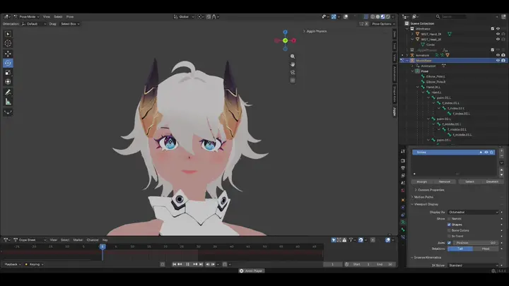
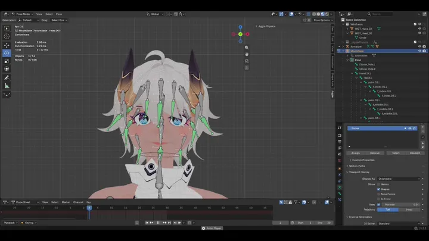
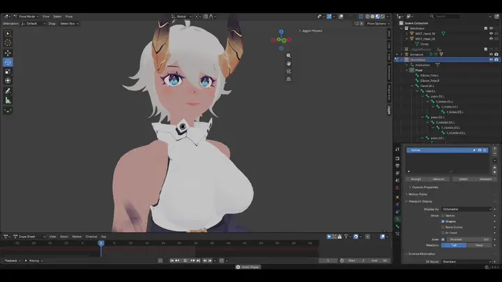
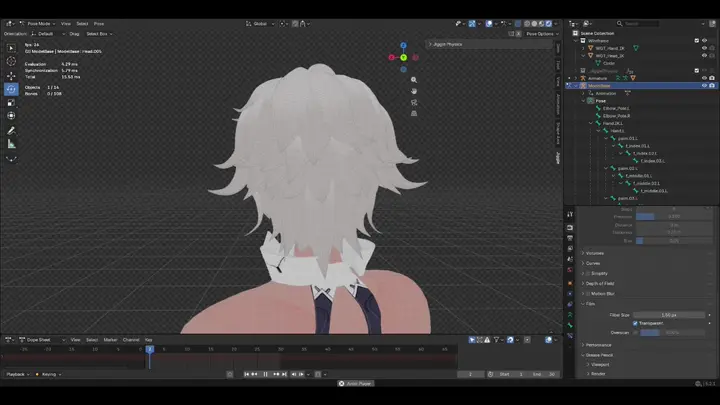

# EXea Jiggle

Effortless real-time secondary motion and jiggle physics for bones in Blender. Bring hair, tails, clothing, breasts, and accessories to life without manual keyframing.

Developed by **Axnise**

  

---

## Showcase

| Front View | Wireframe & Bone Chains |
| :---: | :---: |
|  |  |
| **Side Angle** | **Back View** |
|  |  |

---

## Features

- **Real-time Viewport Simulation** — Preview physics live directly in the 3D Viewport with interactive playback.
- **Chain Dynamics** — Setup entire bone chains (hair strands, tails, ropes) in a single click with configurable tip falloff.
- **Physics Parameters** — Precise control over **Stiffness**, **Damping**, and **Gravity** per bone.
- **Preset System** — Switch between presets (`Soft`, `Medium`, `Firm`) or save custom setups with one click.
- **Clean Keyframe Baking** — Bake simulated motion directly to standard keyframes into your Action, automatically cleaning up temporary helpers and constraints.
- **Batch Utility Controls** — Quickly select all jiggle-enabled bones or remove jiggle across the entire armature.
- **Modern Blender Support** — Full compatibility with Blender 4.2+ Extensions system as well as Blender 3.0–4.1 classic add-on workflows.

---

## Compatibility

| Blender Version | Installation Method |
| :--- | :--- |
| **Blender 4.2, 4.3+** | Drag & Drop `.zip` into Blender, or *Preferences > Get Extensions > Install from Disk* |
| **Blender 3.0 – 4.1** | *Preferences > Add-ons > Install...* |

---

## Installation

### Blender 4.2+ (Extensions)
1. Download `EXeaJiggle_Release.zip` from [Releases](https://github.com/asnise/EXeaJiggle/releases).
2. Open Blender and navigate to **Edit > Preferences > Get Extensions**.
3. Click the dropdown menu in the upper right corner and select **Install from Disk...** (or simply drag and drop the `.zip` file into the 3D viewport).
4. Select `EXeaJiggle_Release.zip`.

### Blender 3.0 – 4.1 (Classic Add-on)
1. Open Blender and navigate to **Edit > Preferences > Add-ons**.
2. Click **Install...** at the top right.
3. Select `EXeaJiggle_Release.zip`.
4. Check the box next to **Animation: EXea Jiggle** to enable it.

---

## Quick Start

1. **Select Armature**: Select your character armature and switch to **Pose Mode** (`Ctrl + Tab`).
2. **Open Sidebar**: Press `N` in the 3D Viewport and switch to the **EXea Jiggle** tab.
3. **Apply Physics**:
   - For a single bone: Select the bone and click **Apply Jiggle**.
   - For a hair strand or tail: Select the **root bone** of the chain and click **Setup Chain (Tail/Hair)**.
4. **Preview**:
   - Click **Start Real-time** to interactively pose or move the character.
   - Or press `Spacebar` to play your existing animation and watch secondary motion react dynamically.
5. **Tune Parameters**: Adjust **Stiffness**, **Damping**, and **Gravity** using the sliders or choose a **Preset**.
6. **Bake**: When satisfied, select the bones and click **Bake to Keyframes**. The simulation is converted to clean Action keyframes and all helper constraints are automatically cleaned up.

---

## Parameters Reference

- **Stiffness** (0.0 – 1.0): Resistance to bending and displacement. Higher values make the bone snap back quickly; lower values create a loose, jelly-like wobble.
- **Damping** (0.0 – 1.0): Friction/energy absorption. Lower values cause longer oscillation; higher values absorb motion quickly.
- **Gravity** (0.0 – 2.0): Downward gravitational pull on the bone tip.
- **Falloff** (Chain Setup): Stiffness multiplier per hierarchy depth. A falloff of `0.85` makes bone tips floppier and more dynamic than the root.

---

## Presets

- **Soft**: Low stiffness and damping for fluid, loose motion (large tails, loose hair, jelly).
- **Medium**: Balanced spring and damping for general cloth, clothing accessories, and anime hair.
- **Firm**: High stiffness and damping for stiff antennae, badges, straps, or subtle breast bounces.
- **Custom Presets**: Click **Save Preset** to store current bone settings. Access preset JSON anytime via **Open Presets Folder**.

---

## License

This project is licensed under the [GNU General Public License v3.0 (GPL-3.0)](LICENSE).
